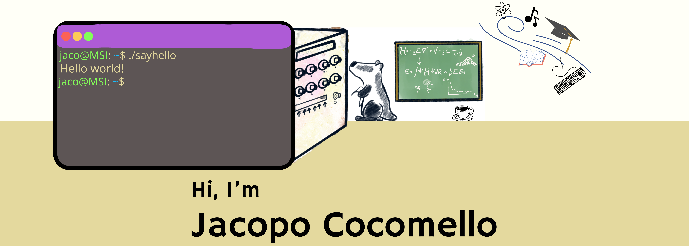

<!-- height="250px" width="500px" -->

### Hi, I'm Jacopo! 👋🦡

I'm a computing enthusiast! I mostly build software to simulate physical phenomena, but I also like building small websites and writing scripts to help automate tasks.

Some facts about me and what I do:
- 🔭 I’m a theoretical and computational physicist, I graduated from the University of Trento and spent 1 year at the University of Twente
- 👨‍🏫 I think education is one of the most basic aspects of human life as humans are social beings and good education makes good societies
- 🌱 I'm mostly acknowledged in quantum and statistical physics
- ⚡ Other than science, my greatest passion is languages in general! (From my perspective, physics and coding are particular kinds of languages.)
- 🌍 I can speak Italian 🇮🇹 (my mother language), English 🇬🇧, and some Dutch 🇳🇱 and I'm learning Japanese 🇯🇵

## Stats

  
  

## Languages and tools
